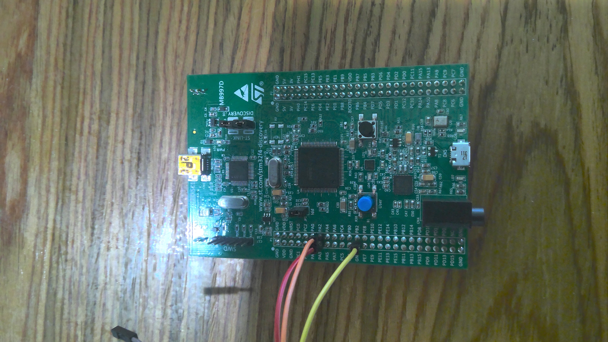

# `stm32f4discovery-uart`

This project contains example code on how to initialize and use the USART on the STM32F4Discovery board to implement simple serial communication.

## Building and Running
Follow the instructions in the [Rust Embedded Book](https://docs.rust-embedded.org/book/intro/install/linux.html) to download the necessary components. Additionally, make sure the `thumbv7em-none-eabi` target is installed on your *nightly* Rust toolchain:

```
rustup target add thumbv7em-none-eabi
```

From here we can compile with 

```
cargo build
```

Before connecting to the board, we must wire it up properly and initialize a serial connection. If you are using a USB-to-UART adaptor, wire the RX pin of the adaptor to PA2 on the board, wire the TX pin of the adaptor to PA3 on the board, and wire the ground pin on the adaptor to GND on the board.



Then, using the serial terminal of your choice, open a connection on the serial port from the adaptor with the following settings:
- Baudrate: 9600 bits/second
- Bits per word: 8
- Stop bits: 1
- Parity: None

Now, from the root of this directory, run

```
openocd
```
after plugging in the board using the STLINK-v2 adaptor. In a new terminal, also from the root of this directory run 
```
arm-none-eabi-gdb -q ./target/thumbv7em-none-eabi/debug/stm32f4discovery-uart
``` 
or on Ubuntu
```
gdb-multiarch -q ./target/thumbv7em-none-eabi/debug/stm32f4discovery-uart
```
to open a debugging session. 

Finally, connect to the board and run the program with
```
(gdb) target remote :3333
...
(gdb) load
...
(gdb) monitor arm semihosting enable
...
(gdb) continue
```

At this point, you should see some text output on the serial console. Additionally, the device will echo anything sent over the serial port back out onto the serial console.